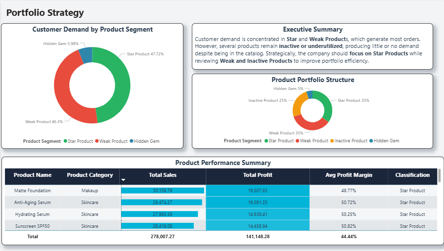

# E-Commerce Profitability & Strategic Portfolio Analysis
**SQL | PostgreSQL | Power BI | Business Analytics**

---

# Executive Summary

This project delivers a deep-dive analysis into the profitability and product portfolio performance of an e-commerce business. Using **5,000+ orders**, the analysis identifies high-performing **Star Products**, evaluates the impact of discount strategies on profitability, and highlights inactive products within the catalog.

### Key Business Results

• **$278K Total Revenue** generated across all orders  
• **$141K Total Profit** with an operational **44.48% profit margin**, **$5K Profit Improvement Opportunity** identified through discount optimization  
• **25% Catalog Inactivity:** 5 out of 20 products generated **zero orders**

When including inactive products across the entire portfolio, the average margin slightly adjusts to **44.44%**, highlighting the impact of underutilized inventory.

---

# Business Problem

The company lacked visibility into which products truly drive profitability. While sales volume appeared strong, discounts and underperforming products were quietly reducing margins.

Management needed answers to the following questions:

1. Which products generate the **highest revenue and profit margins**?
2. How much profit is potentially **lost due to discounting strategies**?
3. Which products remain **inactive despite being listed in the catalog**?

---

# Methodology & Tech Stack

The project follows an end-to-end analytics workflow that transforms raw transactional data into actionable insights.

### Analytical Workflow (SQL Step-by-Step)

**01. Database Setup** Initialized the PostgreSQL environment, defined schemas, and established primary/foreign key relationships between orders and products.

**02. Data Exploration** Performed initial audit of the dataset, validated order counts, and confirmed the "Catalog Gap" where 5 products had zero associated sales.

**03. Profit Engine** Developed the core logic for calculating Revenue, Cost, Gross Profit, and Margin Percentage at the individual order level.

**04. Loss Analysis** Identified the volume of loss-making orders to determine where discounting or high costs were eroding company value.

**05. Margin & Revenue Distribution** Aggregated data by product to analyze how revenue is distributed across the catalog vs. how much profit each item contributes.

**06. Profit Simulation** Modeled a "What-If" scenario to quantify the financial impact of reducing overall discount depth by 20%.

**07. Portfolio Segmentation** Applied a custom CTE-based quadrant model to segment products into **Stars, Volume Drivers, Hidden Gems, and Weak Products.**

**08. Power BI Dataset Creation** Finalized a clean, transformed table optimized for high-performance visualization in Power BI.

---

# Technical Skills Demonstrated

### SQL (PostgreSQL)

• JOIN operations  
• Aggregations (SUM, AVG)  
• CASE segmentation logic  
• CTE (Common Table Expressions)  
• Profit margin calculations  
• Revenue and cost modeling

### Power BI

• Data modeling  
• DAX measure creation  
• Interactive dashboard design  
• Business KPI visualization

---

# Strategic Analysis & Visuals

## Portfolio Health & Segmentation

Products were segmented based on **revenue and margin performance**, revealing where demand and profitability are concentrated.

The **Portfolio Strategy dashboard** shows that **25% of the catalog is inactive**, meaning several products remain unused despite being available for sale.

---

## Discount Sensitivity Analysis

The analysis evaluates how discounts influence profitability.

A simulation scenario tested the impact of **reducing discount depth by 20%**, revealing a potential **$5K increase in total profit** while maintaining revenue levels.

---

## Product Performance Deep-Dive

The **Product Performance dashboard** provides a detailed breakdown of revenue, profit, and margin for each product.

This enables managers to identify:

• High-performing **Star Products** • Low-margin **Weak Products** • Underutilized **Hidden Gems**

---

# Strategic Recommendations

**1️⃣ Inventory Optimization** Review or remove the **5 inactive products** to reduce inventory inefficiencies.

**2️⃣ Discount Strategy Optimization** Adjust discount levels to prevent profit erosion while maintaining demand.

**3️⃣ Focus on Star Products** Allocate additional marketing and inventory resources toward high-performing products.

**4️⃣ Monitor Weak Products** Evaluate pricing strategies or reposition products with low profitability.

---

# Future Improvements

Potential extensions of this project include:

• Customer segmentation analysis  
• Demand forecasting for high-performing products  
• Geographic analysis of product performance  
• Customer lifetime value modeling

---

# Author

**Ziad Diab**
